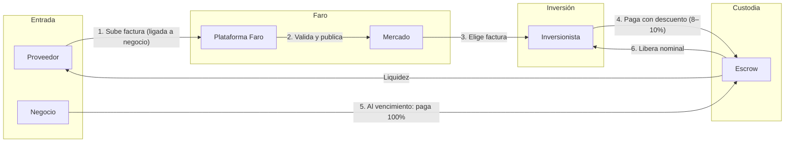
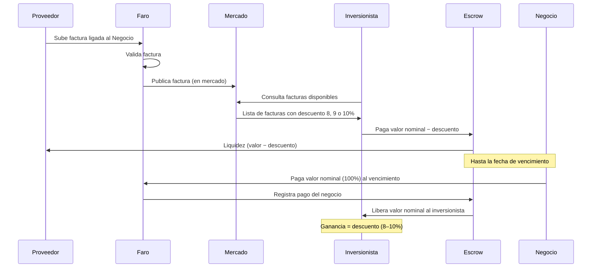
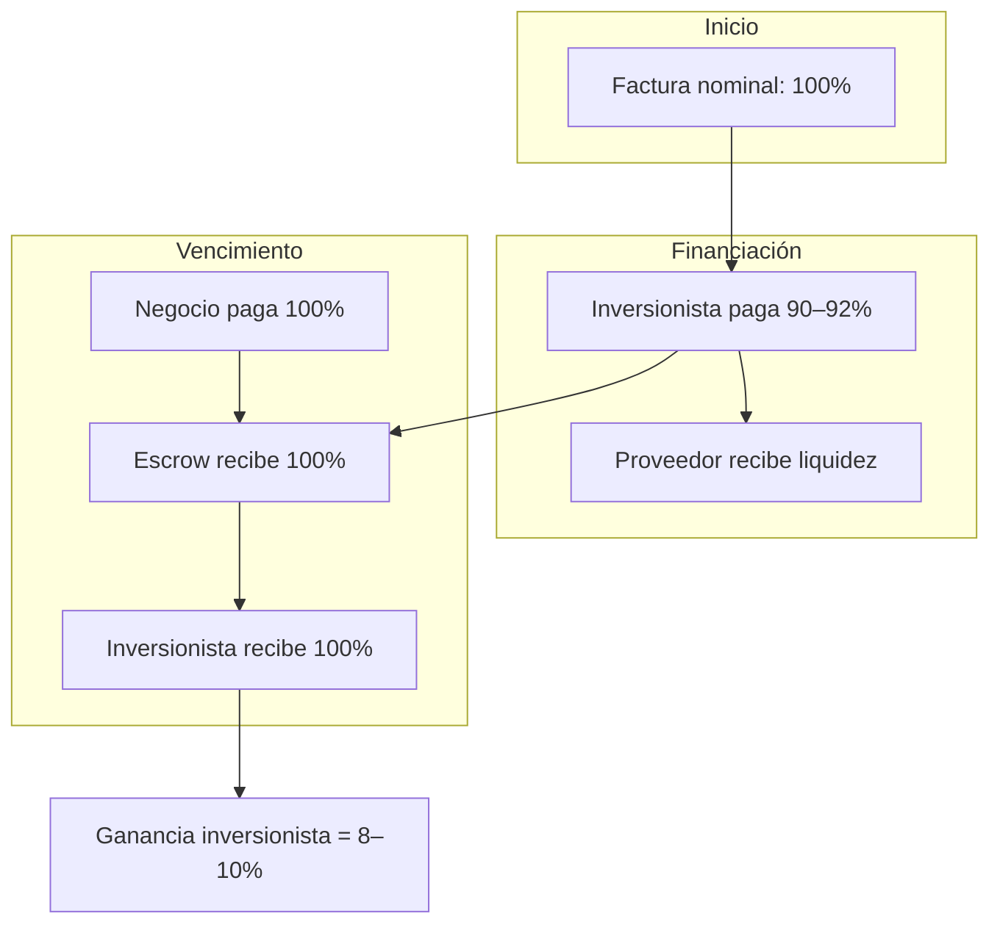
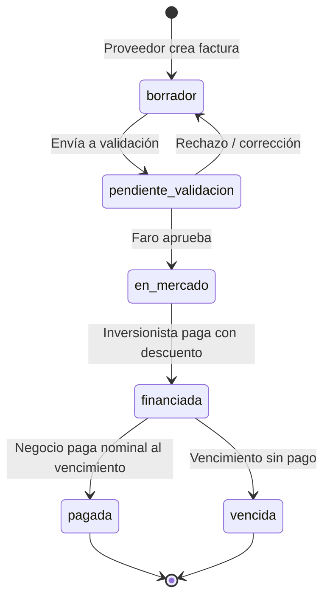
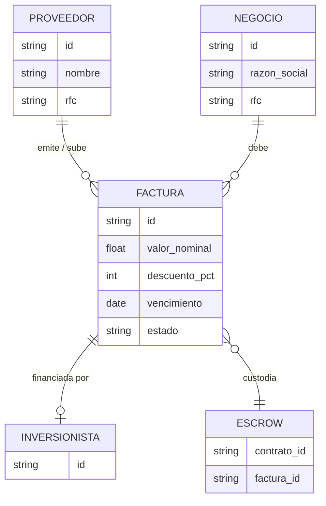

# Faro

> El faro que alumbra y guía tu negocio. Liquidez inmediata para PyMEs mediante factoraje descentralizado sobre Stellar.

Faro es una plataforma de **factoraje de facturas** que conecta a **proveedores** (que emiten facturas), **negocios** (deudores que las pagan) e **inversionistas** (que adelantan el pago con descuento). Los proveedores suben facturas ligadas al negocio deudor; los inversionistas las financian al **8, 9 o 10% de descuento**; el negocio paga el **valor nominal** al vencimiento en la plataforma; un **escrow** (Trustless Work sobre Stellar) libera ese monto al inversionista, que obtiene el descuento como ganancia.

---

## Índice

- [¿Qué es Faro?](#qué-es-faro)
- [Usuarios de la plataforma](#usuarios-de-la-plataforma)
- [Flujo de la plataforma](#flujo-de-la-plataforma)
- [Diagramas de flujo (Mermaid)](#diagramas-de-flujo-mermaid)
- [Descuentos y ganancia del inversionista](#descuentos-y-ganancia-del-inversionista)
- [Estados de una factura](#estados-de-una-factura)
- [Tecnología](#tecnología)
- [Estructura del proyecto](#estructura-del-proyecto)
- [Configuración y ejecución](#configuración-y-ejecución)
- [Configuración recomendada (cómo debe estar)](#configuración-recomendada-cómo-debe-estar)
- [Guía si se desconfigura](#guía-si-se-desconfigura)
- [Obtener USDC (testnet)](#obtener-usdc-testnet)
- [Documentación adicional](#documentación-adicional)

---

## ¿Qué es Faro?

Faro resuelve un problema común para las PyMEs: **facturas por cobrar** que vencen en 30, 60 o 90 días generan falta de liquidez. En lugar de esperar al vencimiento, el **proveedor** puede subir la factura a Faro y ligarla al **negocio** que le debe. Un **inversionista** paga la factura con un descuento (8, 9 o 10%) y el proveedor recibe liquidez de inmediato. El negocio paga la factura **completa** (valor nominal) en la fecha acordada; ese pago se canaliza mediante **escrow** al inversionista, que obtiene como ganancia el descuento aplicado.

**Ventajas:**

- **Proveedor:** liquidez anticipada sin esperar el vencimiento.
- **Negocio:** mantiene el plazo de pago acordado; paga una sola vez el 100% en la plataforma.
- **Inversionista:** renta fija predecible (descuento acordado) con respaldo en facturas reales y escrow on-chain.

---

## Usuarios de la plataforma

| Rol | Descripción | Función principal |
|-----|-------------|--------------------|
| **Proveedor** | Quien emite la factura (acreedor). | Sube facturas y las **liga al negocio** deudor. Recibe liquidez cuando un inversionista financia la factura (valor menos descuento). |
| **Negocio** | Empresa que debe la factura (deudor). | Queda **vinculado** al proveedor en la plataforma. Al **vencimiento**, paga en Faro el **valor nominal (100%)** de la factura. |
| **Inversionista** | Quien invierte comprando facturas. | En el **mercado abierto** elige facturas y paga con **8, 9 o 10% de descuento**. Al vencimiento recibe el nominal vía **escrow**; el descuento es su ganancia. |

La plataforma **liga** cada factura a un proveedor y a un negocio, de modo que siempre quede claro quién es el acreedor y quién el deudor.

---

## Flujo de la plataforma

1. **Proveedor** sube una factura emitida y la asocia al **negocio** deudor (por ejemplo por RFC o razón social).
2. **Faro** valida la factura y la publica en el **mercado** (plataforma abierta).
3. **Inversionista** elige una factura y paga con **descuento** (8, 9 o 10%). El proveedor recibe esa liquidez (valor nominal menos descuento, menos comisiones si aplican).
4. Los fondos del inversionista quedan en **escrow** (Trustless Work / Stellar) hasta el vencimiento.
5. En la **fecha de vencimiento**, el **negocio** paga en la plataforma el **valor nominal (100%)**.
6. El **escrow** recibe el pago del negocio y **libera** el monto al **inversionista** que financió la factura.
7. El inversionista recibe el nominal; su **ganancia** es el descuento (menos comisiones). El negocio pagó la factura completa; el proveedor ya había recibido la liquidez.

---

## Diagramas de flujo (Mermaid)

### Flujo general: actores y etapas



### Secuencia completa del flujo



### Flujo del dinero



### Estados de la factura



### Relación proveedor–negocio–factura



---

## Descuentos y ganancia del inversionista

La plataforma ofrece facturas con **8, 9 o 10% de descuento** sobre el valor nominal. El **negocio siempre paga el 100%**; la diferencia es la ganancia del inversionista.

**Ejemplo (10% de descuento):**

| Concepto | Monto |
|----------|--------|
| Valor nominal de la factura | $100,000 MXN |
| Descuento (10%) | $10,000 |
| Inversionista paga (proveedor recibe como liquidez) | $90,000 |
| Negocio paga al vencimiento | $100,000 |
| Inversionista recibe (vía escrow) | $100,000 |
| **Ganancia bruta del inversionista** | **$10,000** |

En el código (ver `lib/product/roles.ts`):

- `amountAfterDiscount(nominal, discountPercent)` → monto que paga el inversionista.
- `investorGrossProfit(nominal, discountPercent)` → ganancia bruta del inversionista.

---

## Estados de una factura

| Estado | Descripción |
|--------|-------------|
| **Borrador** | El proveedor está creando o editando la factura. |
| **Pendiente de validación** | Enviada a Faro para revisión antes de publicar. |
| **En mercado** | Publicada; los inversionistas pueden verla y financiarla. |
| **Financiada** | Un inversionista ya pagó con descuento; los fondos están en escrow. |
| **Pagada** | El negocio pagó el valor nominal; el escrow liberó los fondos al inversionista. |
| **Vencida** | Pasó la fecha de vencimiento sin que el negocio pagara (disputa/cobro). |

Definición en código: `lib/product/invoice-flow.ts` (`InvoiceStatus`, `INVOICE_STATUS_LABELS`).

---

## Tecnología

- **Frontend:** Next.js 16 (App Router), React 19, TypeScript, Tailwind CSS, Radix UI, shadcn/ui.
- **Blockchain / pagos:** Stellar (SEP-0002 Federation, SEP-0004 Tx Status, SEP-0006 Deposit/Withdrawal).
- **Tokenización:** [OpenZeppelin Stellar Contracts](https://docs.openzeppelin.com/stellar-contracts) (RWA para facturas, Access Control, Pausable, Fee Abstraction).
- **Escrow:** [Trustless Work](https://github.com/Trustless-Work/Trustless-Work-Smart-Escrow) (contratos Soroban, USDC).

La interfaz usa una paleta “Faro”: azul marino (confianza/seriedad) y acento ámbar (luz del faro), con tipografía Plus Jakarta Sans.

---

## Estructura del proyecto

```
├── app/                    # Next.js App Router
│   ├── page.tsx             # Landing pública
│   ├── app/                 # App autenticada (dashboard, tokenizar, mercado, ajustes)
│   └── layout.tsx
├── components/
│   ├── landing/             # Hero, navbar, features, how-it-works, footer
│   ├── app/                 # Sidebar, header, páginas del dashboard
│   └── ui/                  # Componentes base (shadcn)
├── lib/
│   ├── product/             # Roles, estados de factura, descuentos (Product doc)
│   ├── stellarsep/          # Clientes SEP-2, SEP-4, SEP-6
│   └── trustless-work/      # Cliente API escrow
├── contracts/                 # Contratos Soroban (tokenización)
│   ├── faro_invoice_token/    # Token fungible minteable (OpenZeppelin)
│   └── README.md              # Build y deploy (Testnet)
├── docs/
│   ├── PRODUCT-USUARIOS-Y-FLUJO.md   # Usuarios y flujo detallado
│   ├── SEP-AND-TRUSTLESS-WORK.md     # Configuración SEP y Trustless Work
│   ├── TOKENIZATION-OPENZEPPELIN.md  # Tokenización con OpenZeppelin Stellar
│   └── MVP-ROADMAP.md                # Pasos para MVP funcional
├── .env.example
└── README.md
```

---

## Configuración y ejecución

### Requisitos

- Node.js 18+
- pnpm (recomendado) o npm

### Instalación

```bash
pnpm install
```

### Variables de entorno

Copia `.env.example` a `.env` y ajusta según tu entorno (backend/anchor y Trustless Work):

```bash
cp .env.example .env
```

| Variable | Uso |
|----------|-----|
| `NEXT_PUBLIC_FEDERATION_SERVER_URL` | SEP-0002 Federation |
| `NEXT_PUBLIC_AUTH_SERVER_URL` | SEP-0004 Tx Status |
| `NEXT_PUBLIC_TRANSFER_SERVER_URL` | SEP-0006 Deposit/Withdrawal |
| `NEXT_PUBLIC_TRUSTLESS_WORK_API_URL` | API Trustless Work (escrow) |
| `TRUSTLESS_WORK_API_KEY` | API key (recomendado solo en servidor) |
| `NEXT_PUBLIC_TRUSTLESS_WORK_PLATFORM_ADDRESS` | Cuenta Stellar con **USDC** para el rol plataforma del escrow; en test puede ser tu misma wallet de inversionista. Si no se define, se usa la del inversionista. |
| `NEXT_PUBLIC_STELLAR_NETWORK` | `testnet` o `mainnet` |

**Para invertir (escrow):** tu wallet de inversionista debe tener **USDC** (trustline). La cuenta usada como plataforma también debe tener USDC; si no configuras `NEXT_PUBLIC_TRUSTLESS_WORK_PLATFORM_ADDRESS`, se usa la del inversionista. Ver [Obtener USDC (testnet)](#obtener-usdc-testnet).

### Configuración recomendada (cómo debe estar)

El proyecto está configurado para **Stellar Testnet**. No modifiques red ni contrato sin seguir [contracts/README.md](contracts/README.md) para redesplegar.

**Valores que deben coincidir:**

| Qué | Valor correcto |
|-----|----------------|
| Red de la app y wallet | `NEXT_PUBLIC_STELLAR_NETWORK=testnet` |
| RPC Soroban (front) | `NEXT_PUBLIC_SOROBAN_RPC_URL=https://soroban-testnet.stellar.org` |
| RPC Soroban (backend, mint) | `SOROBAN_RPC_URL=https://soroban-testnet.stellar.org` |
| Passphrase (backend) | `SOROBAN_NETWORK_PASSPHRASE="Test SDF Network ; September 2015"` |
| Contrato tokenización | `FARO_INVOICE_TOKEN_CONTRACT_ID` = ID del contrato desplegado en **testnet** (ej. el de `contracts/faro_invoice_token/deploy-testnet.sh`) |
| API Trustless Work (dev) | `NEXT_PUBLIC_TRUSTLESS_WORK_API_URL` apuntando a testnet (ej. `https://dev.api.trustlesswork.com` si aplica) |

**Cuenta admin (tokenización):** `FARO_TOKEN_ADMIN_SECRET_KEY` debe ser la clave secreta de la cuenta que se usó como `--admin` al desplegar el contrato. Esa cuenta debe tener XLM en testnet para pagar fees del `mint`.

**Wallet:** En Freighter (u otra) selecciona **Testnet** para que las transacciones y los enlaces de Stellar Expert coincidan.

### Guía si se desconfigura

Si algo deja de funcionar (tokenizar, invertir, “Transaction not found”, facturas que no aparecen para el deudor), revisa en este orden:

1. **Revisar `.env`**
   - Que existan `SOROBAN_RPC_URL`, `SOROBAN_NETWORK_PASSPHRASE`, `FARO_INVOICE_TOKEN_CONTRACT_ID`, `FARO_TOKEN_ADMIN_SECRET_KEY` para tokenización.
   - Que **no** mezcles testnet con futurenet: si el contrato está en testnet, las cuatro variables deben ser de testnet (RPC testnet, passphrase `"Test SDF Network ; September 2015"`, contract ID del deploy en testnet).
   - Ver [Configuración recomendada (cómo debe estar)](#configuración-recomendada-cómo-debe-estar).

2. **Reiniciar el servidor**
   - Tras cambiar `.env`, reinicia `pnpm dev` (o `npm run dev`) para que el backend cargue las variables nuevas.

3. **“Transaction not found” en Stellar Expert**
   - El enlace usa la red de `NEXT_PUBLIC_STELLAR_NETWORK` (y para tokenize, testnet). Si la tx se envió a otra red (p. ej. por passphrase incorrecto en backend), el explorador no la mostrará.
   - Solución: Ajusta `SOROBAN_RPC_URL` y `SOROBAN_NETWORK_PASSPHRASE` a testnet, reinicia el servidor y tokeniza de nuevo. El hash nuevo debería verse en [Stellar Expert Testnet](https://stellar.expert/explorer/testnet).

4. **Tokenización (mint) falla con 502**
   - Falta alguna variable de tokenización o la cuenta admin no tiene XLM en testnet.
   - Solución: Comprueba las cuatro variables anteriores y fondea la cuenta admin en testnet (Friendbot o similar). Ver [contracts/README.md](contracts/README.md).

5. **El deudor no ve facturas “por pagar”**
   - La factura debe tener **Dirección Stellar del deudor** guardada al tokenizar, y el deudor debe conectar **esa misma wallet**.
   - Solución: Al tokenizar, rellenar “Dirección Stellar del deudor” con la wallet del negocio. El deudor entra con esa wallet en el dashboard.

6. **Restaurar todo a testnet**
   - Copia de nuevo desde `.env.example` las variables de red y tokenización (las líneas de `NEXT_PUBLIC_STELLAR_NETWORK`, `NEXT_PUBLIC_SOROBAN_RPC_URL`, `SOROBAN_RPC_URL`, `SOROBAN_NETWORK_PASSPHRASE`, `FARO_INVOICE_TOKEN_CONTRACT_ID`).
   - Si en el pasado desplegaste en testnet con `deploy-testnet.sh`, usa el `FARO_INVOICE_TOKEN_CONTRACT_ID` que imprimió ese script.
   - Reinicia el servidor y pon la wallet en Testnet.

### Obtener USDC (testnet)

Para poder **invertir** en facturas con escrow en Stellar, necesitas USDC en la red que uses (p. ej. testnet):

1. **Faucet Circle (recomendado)**  
   [Circle Testnet Faucet](https://faucet.circle.com/) — elige **Stellar Testnet** y tu dirección; puedes recibir hasta 20 USDC de prueba.

2. **Swap XLM → USDC por terminal (Stellar CLI)**  
   Si ya tienes XLM en testnet, puedes hacer un path payment con la [Stellar CLI](https://developers.stellar.org/docs/tools/cli/stellar-cli):
   - Montos en **stroops** (1 XLM = 10⁷ stroops; USDC 6 decimales).
   - Ejemplo (reemplaza `TU_CUENTA` y montos):  
     `stellar tx new path-payment-strict-send --source TU_CUENTA --send-asset native --send-amount 10000000 --destination TU_CUENTA --dest-asset USDC:EMISOR_USDC --dest-min 1`
   - Ver [Stellar CLI Manual](https://developers.stellar.org/docs/tools/cli/stellar-cli) para `path-payment-strict-send` / `path-payment-strict-receive` y el emisor USDC de tu red.

Detalles de swap y emisores USDC por red están en [docs/SEP-AND-TRUSTLESS-WORK.md](docs/SEP-AND-TRUSTLESS-WORK.md#obtener-usdc-testnet--swap-cli).

### Desarrollo

```bash
pnpm dev
```

Abre [http://localhost:3000](http://localhost:3000). La landing está en `/`; el dashboard en `/app`.

### Build y producción

```bash
pnpm build
pnpm start
```

---

## Documentación adicional

- **[docs/PRODUCT-USUARIOS-Y-FLUJO.md](docs/PRODUCT-USUARIOS-Y-FLUJO.md)** — Usuarios (proveedor, negocio, inversionista), ligado proveedor–negocio, flujo paso a paso y relación con escrow.
- **[docs/SEP-AND-TRUSTLESS-WORK.md](docs/SEP-AND-TRUSTLESS-WORK.md)** — Integración Stellar (SEP-2, SEP-4, SEP-6) y Trustless Work; variables de entorno y uso en código.
- **[docs/TOKENIZATION-OPENZEPPELIN.md](docs/TOKENIZATION-OPENZEPPELIN.md)** — Tokenización de facturas con contratos OpenZeppelin para Stellar Soroban (RWA, Access Control, Pausable).
- **[docs/MVP-ROADMAP.md](docs/MVP-ROADMAP.md)** — Pasos para tener un MVP funcional (API, tokenizar, mercado, invertir, dashboard).

---

## Resumen visual del flujo

```
Proveedor sube factura (ligada a Negocio)
         ↓
Faro valida y publica en el mercado
         ↓
Inversionista paga con 8, 9 o 10% descuento → Proveedor recibe liquidez
         ↓
Escrow retiene hasta vencimiento
         ↓
Negocio paga 100% en la plataforma
         ↓
Escrow libera al Inversionista → Ganancia = descuento
```

---

*Faro — Liquidez y guía para tu negocio.*
